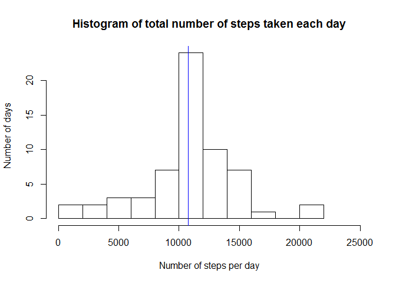

# Reproducible Research: Peer Assessment 1


## Loading and preprocessing the data

The data for this assignment was downloaded and extracted from the course web site:
[activity monitoring data](https://d396qusza40orc.cloudfront.net/repdata%2Fdata%2Factivity.zip) [52K] at 2015-08-14 11:38 CEST.

The variables included in this dataset are:

- steps: Number of steps taking in a 5-minute interval (missing values are coded as NA)
- date: The date on which the measurement was taken in YYYY-MM-DD format
- interval: Identifier for the 5-minute interval in which measurement was taken
- The dataset is stored in the comma-separated-value (CSV) file "activity.csv"" and there are a total of 17,568 observations in this dataset.

1. The data were loaded and
2. tranformed into a matrix filled with the number of steps
per 5-minute-interval and where the colums are the dates and the rows are numbered by the minute of that day, when the interval started.


```r
total_activity_data <- read.csv("activity.csv")
daily_activity_matrix <- sapply(split(total_activity_data,
        total_activity_data$date), function(x){x$steps})
rownames(daily_activity_matrix) <- 5*(1:nrow(daily_activity_matrix))-5
daily_activity_matrix[100:106,1:6]
```

```
##     2012-10-01 2012-10-02 2012-10-03 2012-10-04 2012-10-05 2012-10-06
## 495         NA          0          0        522        122        149
## 500         NA          0         22        510        400          0
## 505         NA          0         57        519        451         82
## 510         NA          0        161        508        371         94
## 515         NA          0         19        423        470        225
## 520         NA          0         15        499        473        216
## 525         NA          0          0        259        512        199
```

## What is mean total number of steps taken per day?

1. The total number of steps per day were calculated (missing values were ignored).


```r
daily_steps <- colSums(daily_activity_matrix, na.rm=TRUE)
head(daily_steps)
```

```
## 2012-10-01 2012-10-02 2012-10-03 2012-10-04 2012-10-05 2012-10-06 
##          0        126      11352      12116      13294      15420
```


2. The mean and median number of daily steps were calculated.


```r
mean_daily_steps <- mean(daily_steps, na.rm=TRUE)
mean_daily_steps
```

```
## [1] 9354.23
```

```r
median_daily_steps <- median(daily_steps, na.rm=TRUE)
median_daily_steps
```

```
## [1] 10395
```

The mean is 9354 steps per day and 
the median is 1.0395\times 10^{4} steps per day.


3. A histogram of the total number of steps taken each day was created.
The mean is indicated in red and the median in blue.

```r
hist(daily_steps, breaks=11, 
     xlim=c(0,25000), 
     xlab="Number of steps per day", 
     ylab ="Number of days", 
     main="Histogram of total number of steps taken each day")
abline(v=mean_daily_steps,col="red")
abline(v=median_daily_steps,col="blue")
```

 


## What is the average daily activity pattern?

1. The average number of steps per interval taken, averaged across all days,
were calculated and the corresponding time series was plotted.
   

```r
mean_interval_activity <- rowMeans(daily_activity_matrix,na.rm=T)
plot.ts(mean_interval_activity, main="Daily activity pattern", xlab="No. of 5-minute-inteval of the day", ylab="Steps per 5 minutes")
```

 

2. The time of the interval of maximal activity was computed.


```r
max_activity_interval <- which.max(mean_interval_activity)-1
max_activity_minute <- (max_activity_interval*5)%%60                     
max_activity_hour <- (max_activity_interval*5 - max_activity_minute)/60 
max_activity_time<-paste(max_activity_hour,max_activity_minute, sep=":")
max_activity_time
```

```
## [1] "8:35"
```

```r
max_activity <- max(mean_interval_activity)
max_activity
```

```
## [1] 206.1698
```

So the 5-minute-interval of maximal activity started at 8:35 AM with an activity of about 206 steps per five minutes.


## Imputing missing values

1. The total number of entries with a missing value is computed in the data matrix (but not in the original data frame, since the other values are not relevant to this task)


```r
number_of_na<-sum(is.na(daily_activity_matrix))
number_of_na
```

```
## [1] 2304
```

So there is a total number of 2304 entries/intervals without messured activity.

2. The NA-values will be filled with the value of that interval averaged over all days.


```r
mean_matrix <- matrix( mean_interval_activity,
           nrow=nrow(daily_activity_matrix),
           ncol=ncol(daily_activity_matrix) ) 
filled_matrix <- daily_activity_matrix
na_pos <- is.na(daily_activity_matrix)
filled_matrix[na_pos] <- mean_matrix[na_pos]
```

3. Histogram of the total number of steps taken per day after filling in the missing values.


```r
daily_steps_filled <- colSums(filled_matrix)
mean_daily_steps_filled <- mean(daily_steps_filled)
mean_daily_steps_filled
```

```
## [1] 10766.19
```

```r
median_daily_steps_filled <- median(daily_steps_filled)
median_daily_steps_filled
```

```
## [1] 10766.19
```

```r
hist(daily_steps_filled, breaks=11, 
     xlim=c(0,25000), 
     xlab="Number of steps per day", 
     ylab ="Number of days", 
     main="Histogram of total number of steps taken each day")
abline(v=mean_daily_steps_filled,col="red")
abline(v=median_daily_steps_filled,col="blue")
```

 

With the filled data matrix the median number of steps per day is 1.0766\times 10^{4} (in blue) and the median number of steps per das is 1.0766\times 10^{4} (in red, can't be seen under the blue line). Both numbers are very close and higher than the corresponding number from the first part.

Since the missing data was filled with average numbers of the unfilled data, the new histogram is clearly more centered around the mean / median as one can see by the number of counts around the mean.

The impact of imputing missing data on the estimates of the total daily number of steps is that all the previous missing data are shifted to the mean.


## Are there differences in activity patterns between weekdays and weekends?

1. A new factor variable is indluded into the data frame from the beginning indicating if the day is a "weekday" or "weekend".
For later purposes a logical variable is used, which checks if a day is a day of the weekend or not and a factor variable is made out of it.


```r
w <- is.element(as.POSIXlt(total_activity_data$date)$wday, c(0,6))
wday <- as.factor(w)
levels(wday) <- c("weekday","weekend")
total_activity_data$wday <- wday

weekend <- is.element(as.POSIXlt(colnames(filled_matrix))$wday, c(0,6))
```

2. 


```r
weekend_matrix <- filled_matrix[,weekend]
weekday_matrix <- filled_matrix[,!weekend]
mean_interval_activity_weekend <- rowMeans(weekend_matrix)
mean_interval_activity_weekday <- rowMeans(weekday_matrix)
par(mfrow=c(2,1))
plot.ts(mean_interval_activity_weekend, main="Daily activity pattern on weekends", xlab="No. of 5-minute-inteval of the day", ylab="Steps per 5 minutes")
plot.ts(mean_interval_activity_weekday, main="Daily activity pattern on weekdays", xlab="No. of 5-minute-inteval of the day", ylab="Steps per 5 minutes")
```

 

So we can see that there are clear differences between the activity pattern on weekdays and on weekends.
